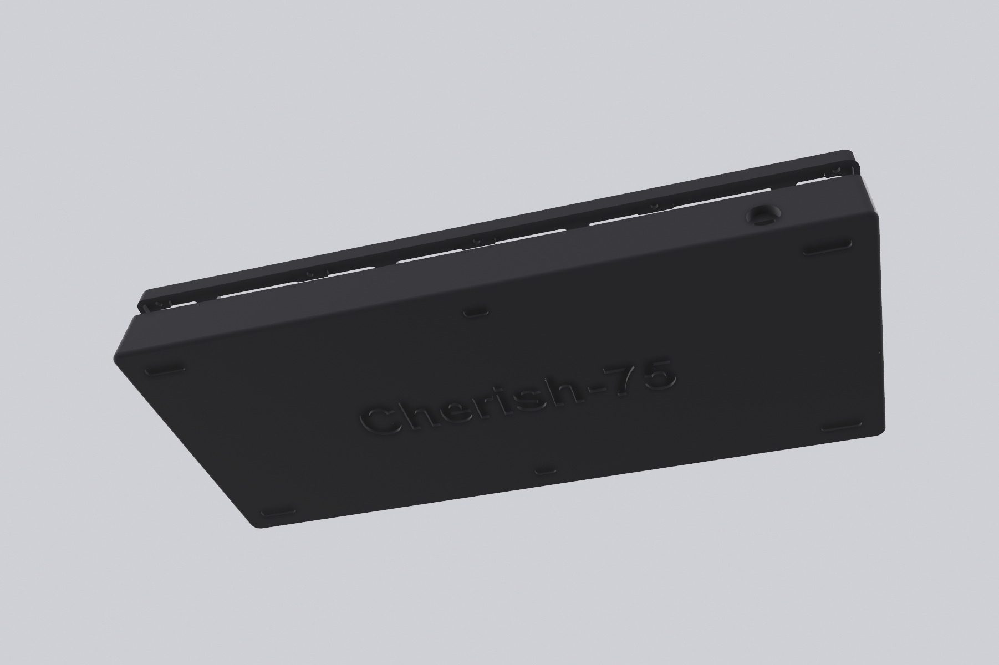
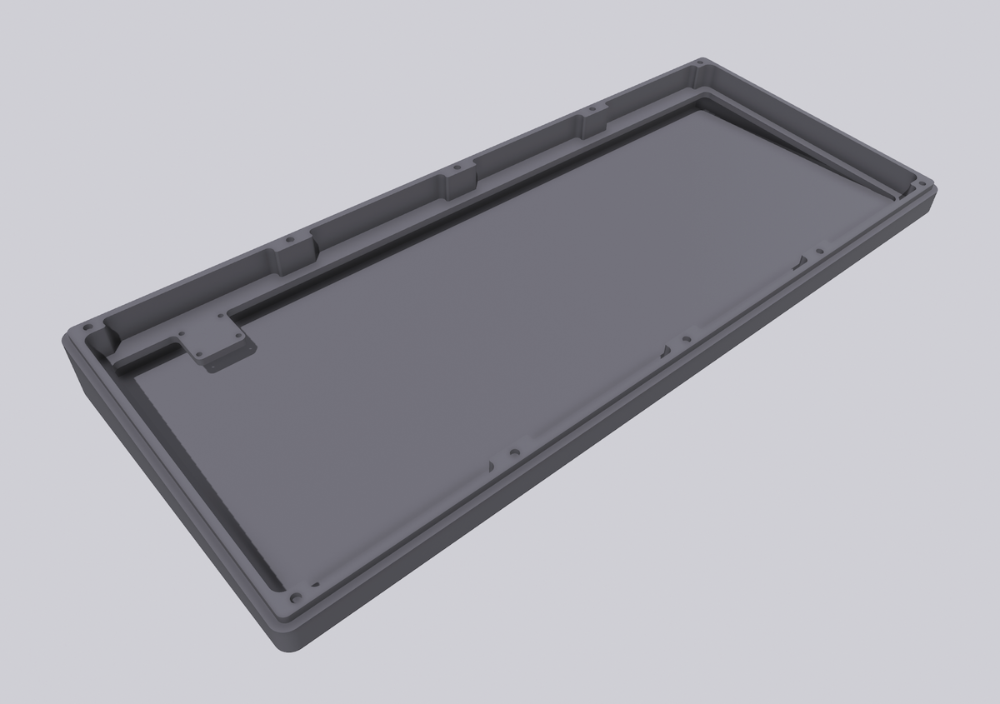

# Cherish-75
Cherish-75，客制化机械键盘，PCB已打样验证，旨在客制化交流分享，禁止商用！

**主控**: STM32F072CBT6, Type-C分离小板

**硬件PCB**：Flex Cut PCB，阻焊开窗(沉金),  立创工程链接:  https://oshwhub.com/caiyahoho/Cherish-75

**配列**：75%，小门牙配列

**轴座**: 焊接&热插拔

**RGB:** 大写键 RGB

**软件**：QMK & VIA，查看 `fireware` 目录

**许可**：GPL3.0, 禁止商用

**外壳**: 3D打印，**磁吸上下盖设计，确保是否满足个人需要，切勿直接打印使用**，查看 `3d-model`目录

**感谢**：客制化入坑半年，工作加班也比较多，感谢老婆大人的宽容让我有时间折腾

### 实体

### Black: 

### White: 

### Daughterboard:

### Layout

**via support**

### Case

### PCB打样

**焊接：**

