## Cherish-75

<p align="left">
  <a href="./README.md">English</a> |
  <a href="./README_CN.md">简体中文</a>
</p>

Cherish-75，Gasket结构客制化机械键盘，PCB已打样验证，配备有制作所有需的所有文件，包括3D外壳，开槽定位板等.

基于Qmk制作，支持Via，固件源码已开源：[源码](https://github.com/qmk/qmk_firmware/tree/master/keyboards/soda/cherish)
## Features
* **License**：MIT，随心取用修改
* **主控**: STM32F072CBT6, Type-C分离小板（保证软弹）
* **硬件PCB**：开槽PCB，可选阻焊开窗(沉金),  立创工程: [链接](https://oshwhub.com/caiyahoho/Cherish-75)
* **配列**：75%，门牙配列
* **轴座**: 同时支持焊接&热插拔
* **RGB:** 大写键下一个RGB贴片灯
* **固件**：QMK & VIA，查看 `fireware` 目录
* **外壳**: 3D打印，**磁吸上下盖设计**

## 说明：

* 磁铁规格: 直径3mm x 2mm厚，TaoB搜；
* 电路板: 5张 嘉立创 110元
* 元器件：轴座，芯片 50元左右吧，立创商城购买;
* 定位板：有开槽和不开槽，材质推荐fr4或pom，30 - 40元一张, TaoB推荐 "骄傲的猫"店，精度高
* PCB每个脚上垫2mm厚的P棉
* 外壳3D打印，可以选择嘉立创的三维猴，或者未来工场，三维猴的精度要高不少，价格也稍贵，上壳+下壳在150 -200元左右吧


## 文件目录

```bash
├── case-and-plate
│   ├── top-case-with-X.stl # 上盖 - X
│   ├── top-case.stl 上盖    # 上盖
│   ├── bottom-case.stl     # 下壳
│   ├── slotted-plate.dwg   # 开槽定位板
│   └── plate.dxf           # 定位板
├── firmware
│   ├── bin                 # qmk固件
│   └── cherish-75-via.json # via Config
├── hardware
│   ├── bom.xlsx            # 元件BOM
│   └── gerber              # PCB 制版文件 
```

---

## 电路板
### 黑色
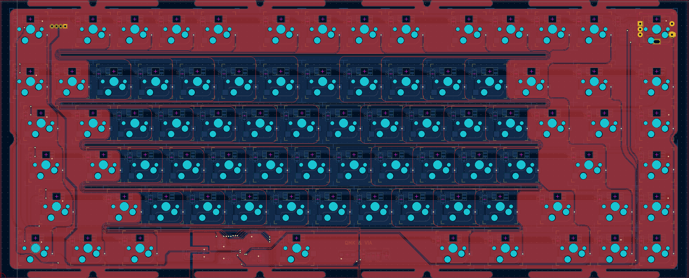

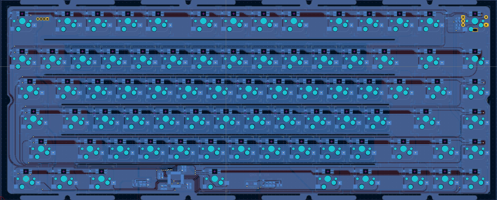

### 白色:
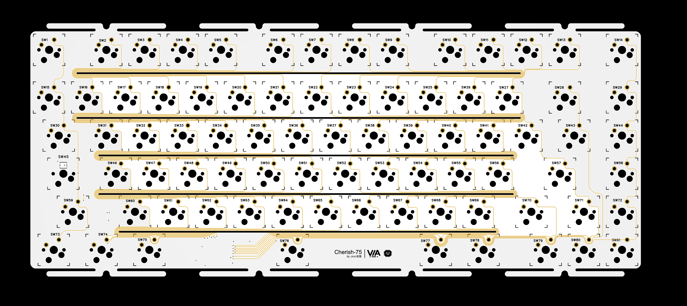

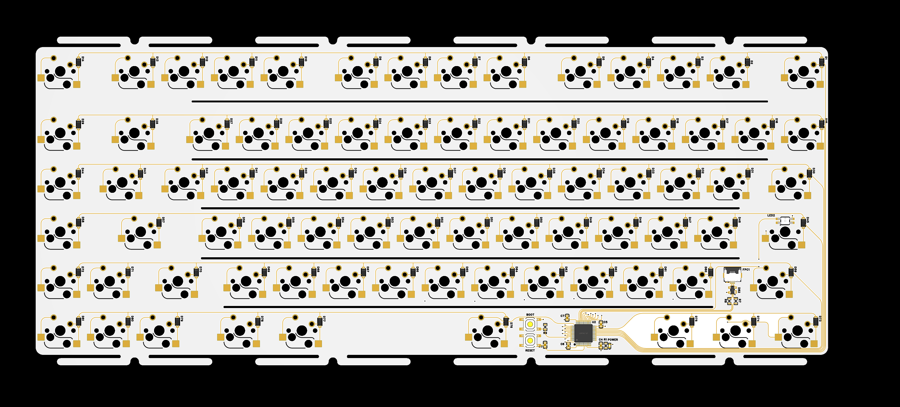

### 子板

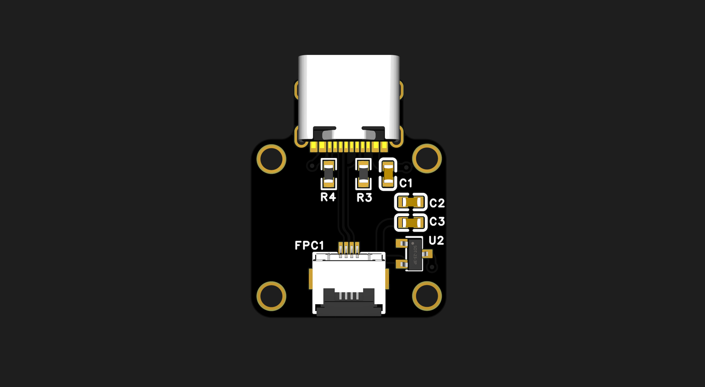

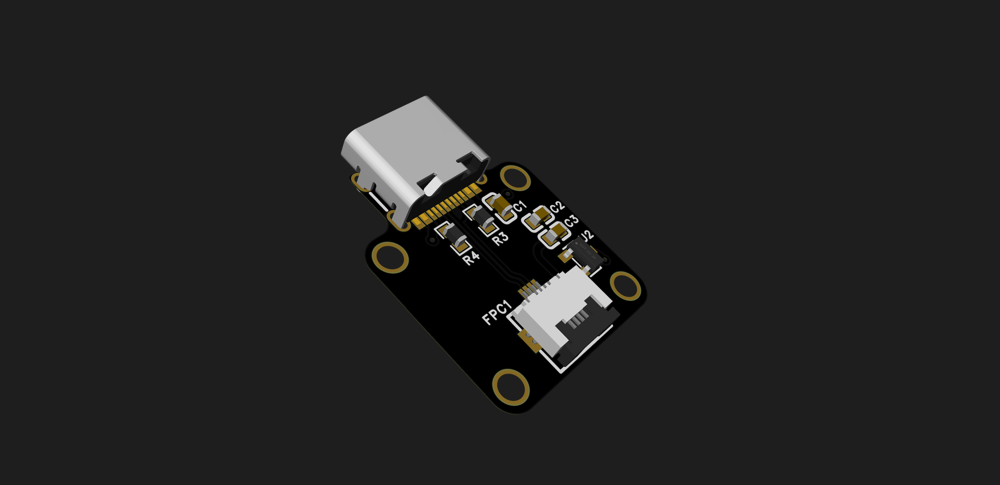

## 配列


**Via**
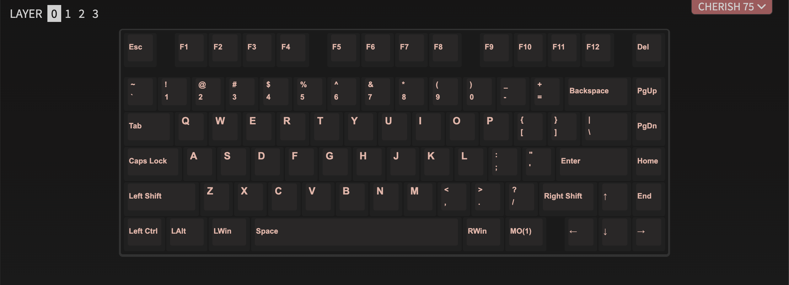

## 外壳
### 上壳 样式1

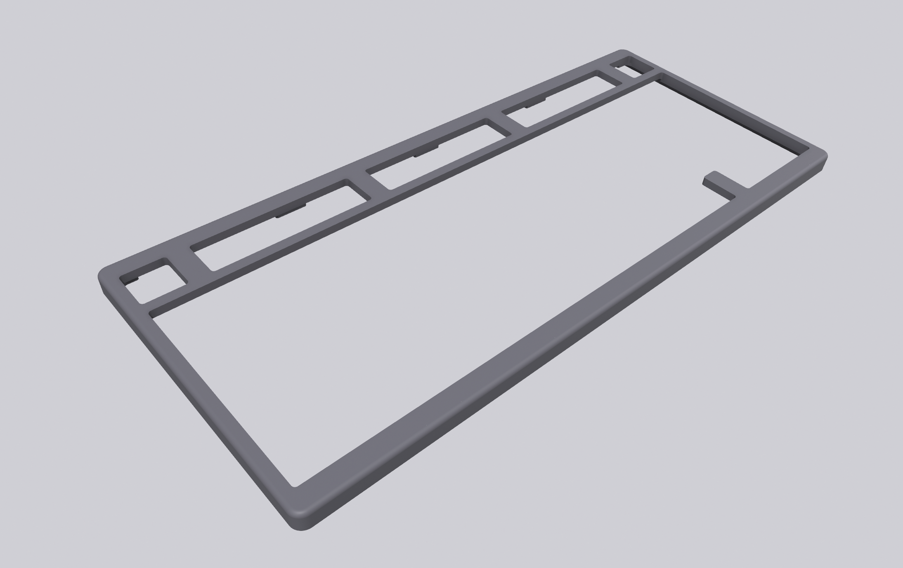

### 上壳 样式2

右下角去除一个按键，增加 `X` 装饰，无限可能

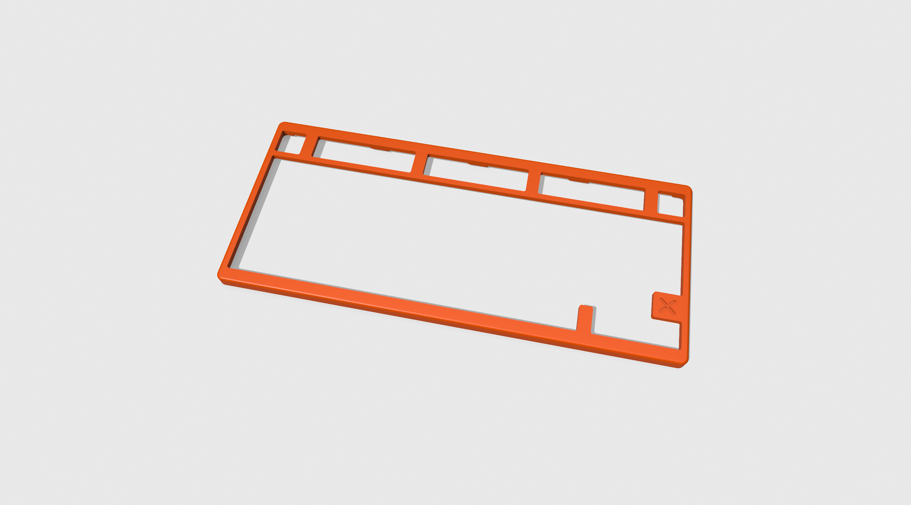

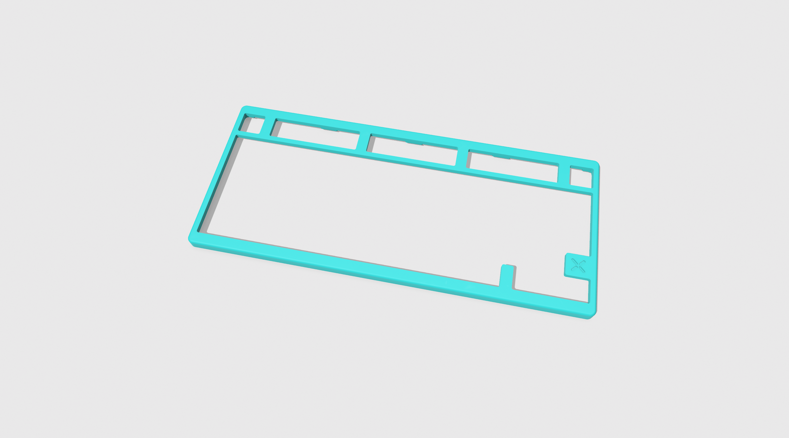


### 整体效果
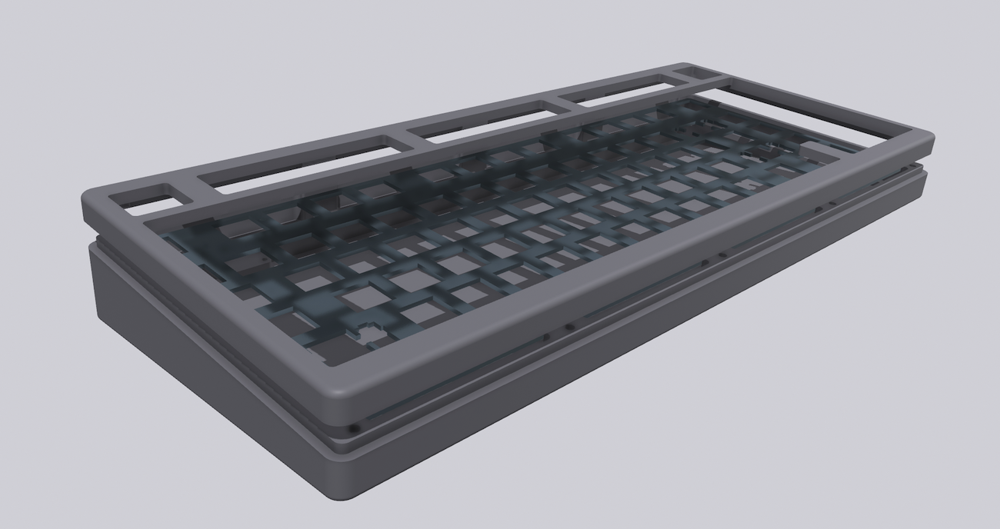

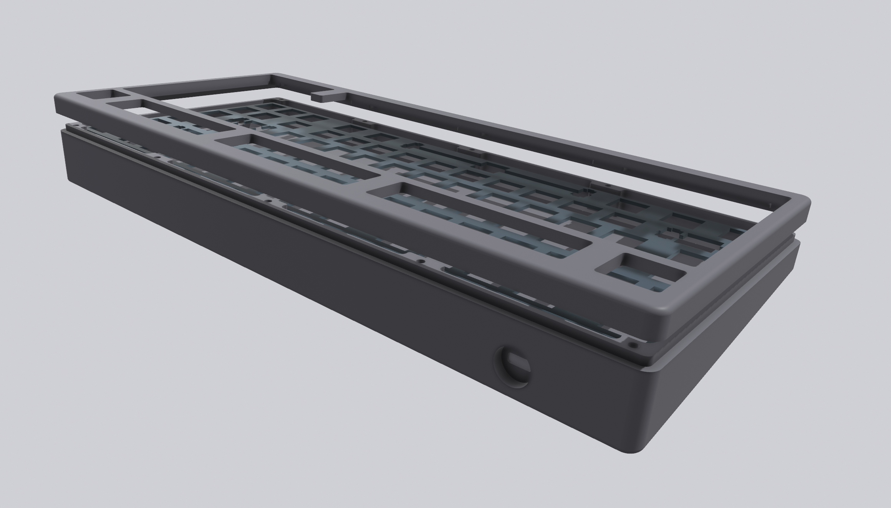

 
## 实体

### PCB打样

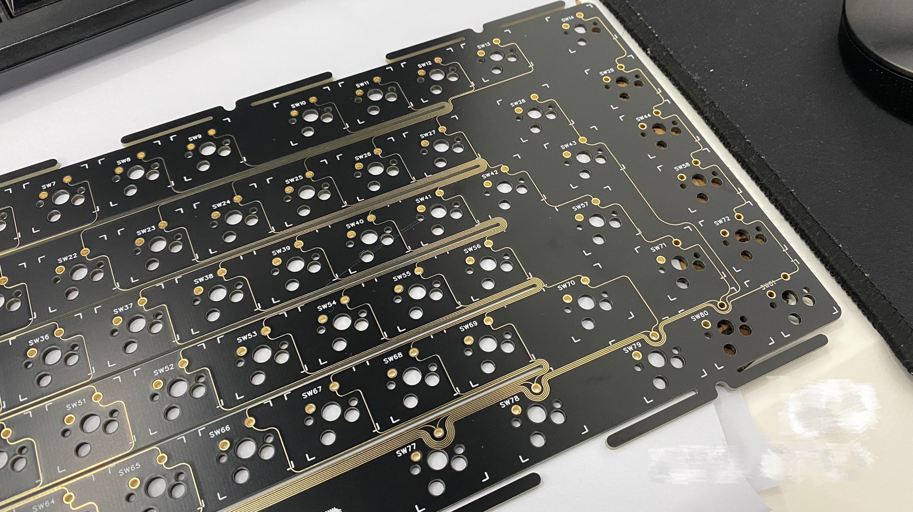


**焊接：**
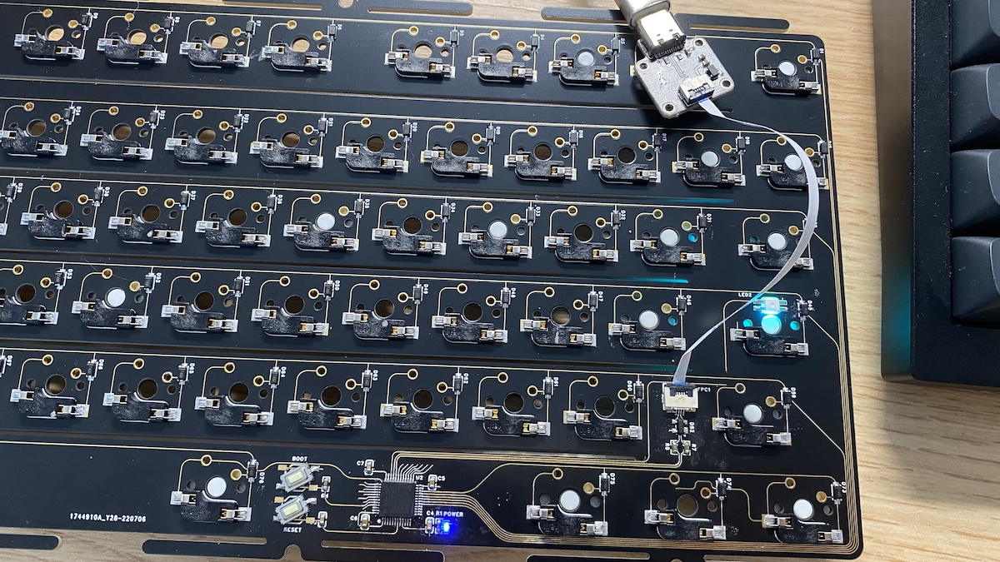


### 定位板

[plate-1.jpg](imgs/plate-1.jpg)

### 组装实体
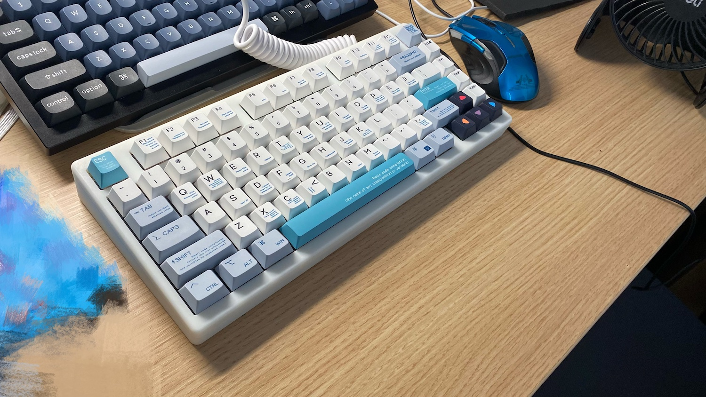

### 视频
**BiliBili**

[](https://www.bilibili.com/video/BV1CS4y1W7Da/)
 
**Youtube**
[](https://www.youtube.com/watch?v=ES9FB7N3KS8&t=7s "Cherish-75")